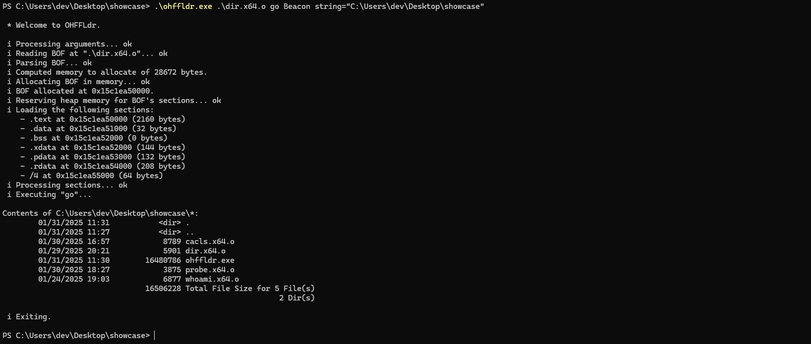

# OHFFLdr

###### One-header configurable C++20 COFF loader

---

### Usage

`ohffldr.exe <object file> <symbol> <api prefix> <opt:arguments>`

Where:

- `<object file>`: path to the BOF;
- `<symbol>`: function's name to load;
- `<api prefix>`: used beacon API function prefix (e.g. _Beacon_ for the Cobalt Strike's API);
- `<opt:arguments>`: data to pass to the BOF.

Arguments must be formatted as `type=value` where type can be `int`, `short`, `string` and `wstring`.

> For composed strings like path with spaces, consider using double quotes (e.g. string="bofs are cool") like shown in the demo.

### Mini Documentation

`ohffldr` class is a static object ready-to-load the passed BOF.

The `load` procedure requires:

1. `path`: location of the object file;
2. `symbol`: function's name to call;
3. `api_prefix`: prefix of the used API (e.g. _Beacon_ for the Beacon API);
4. `argv`: pointer to arguments to pass to the BOF function;
5. `argc`: number of the arguments contained in `argv`.

Its return value is a `bool`.

If the function fails, `get_last_error` can be used to retrieve the error code.

You can find more detailed documentation in the `ohffldr.hpp` file.

### Arguments Packer

`arguments_packer` class will automatically convert your command line parameters into an understandable format 
for BOFs written using the [Cobalt Strike](https://github.com/Cobalt-Strike/bof_template)'s beacon API.

> Note that the version of the API used in this loader may not be up to date and must be configured for your needs.

### Build

If you want to manually build the OHFFLdr launch the `build.sh` script in the `ohffldr/build` folder.

### Releases

Click [here](https://github.com/hruFriend/OHFFLdr/releases) to access the release page and download the precompiled binaries.

### Demo

[whoami](https://github.com/trustedsec/CS-Situational-Awareness-BOF/tree/master/SA/whoami) BOF (x64):

  

[dir](https://github.com/trustedsec/CS-Situational-Awareness-BOF/tree/master/SA/dir) BOF (x64):

  

> OHFFLdr does NOT support 32 bit BOFs.

### Important Notes

Finally, `ohffldr` class has been designed to be easily imported into your project, configured and used.

It is important to say that the loader may need some modifications to the code to be adapted to your implant and work as expected.

### Credits

- [MaldevAcademy](https://maldevacademy.com);
- [COFFLoader](https://github.com/trustedsec/COFFLoader/tree/main) (packer concept);
- [CoffeeLdr](https://github.com/Cracked5pider/CoffeeLdr/tree/main) (`beacon.h`).
